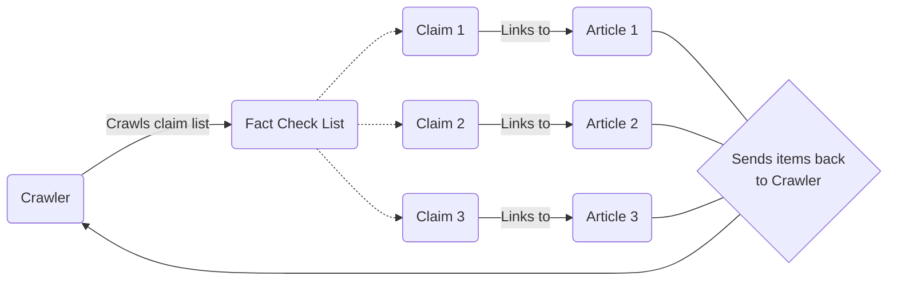

# PolitiFact Web Scraper

This repo runs the web scraper for PolitiFact.com to obtain data.

The inspiration for web scraping is found in this [Medium blog post](https://medium.com/@m.muneeb.ur.rehman.2000/fact-checking-the-fact-checkers-scraping-politifact-com-for-political-truths-with-pythons-scrapy-fcfa42f5bcf2). The associated GitHub repo can be found [here](https://github.com/Muneeb1030/WebScrapper_Politifact/tree/main).

| :warning: WARNING          |
|:---------------------------|
| **February 28, 2024**: The code may or may not work depending on how often [politifact.com](https://www.politifact.com/) changes it's website code. Some of the selectors may need to be altered, but the logic will mainly stay the same |


## Scrapy: How it works

To obtain the data from PolitiFact, we used Scrapy to crawl through the entire website and get the data.



## Data

The following raw table shows the different fields being extracted and its description.

| Field            | Description                                       |
| ---------------- | ------------------------------------------------- |
| `claim `         | The proposed statement to verify                  |
| `claim_source`   | The author/source (X, Instagram) of the claim     |
| `review_date`    | The date that the review article was created      |
| `review_author`  | The author of the review article                  |
| `review_tags`    | Tags relevant to the article                      |
| `review_points`  | PolitiFact's tl;dr list of points                 |
| `review_article` | The article with justification for the claim      |
| `review_url`     | The URL of the article                            |
| `veractiy`         | true/false to evaluate model metric               |

## Installation

1. **Prerequisites**: Ensure you have Python (version 3.10.11 or later) and Poetry installed on your system. You can find installation instructions for both at:
    - Python: https://www.python.org/downloads/
    - Poetry: https://python-poetry.org/docs/

2. **Clone the repository**
    ```bash
    https://github.com/Verif-AI/politifact-web-scraper.git
    ```

3. **Navigate to the project directory**
    ```bash
    cd politifact-web-scraper
    ```

4. **Install Dependencies**
    ```bash
    poetry install --no-root
    ```


## Usage
To run the program using poetry, run the following command

```bash
chmod +x ./run.sh
./run.sh
```

The command does the following
1. Enables `./run.sh` as an executable
1. Deletes `politifact.jsonl` if it alredy exists to start from a clean slate
2. Runs the web scraper spider `politifact_spider.py` and writes it to `politifact.json`

### Reading Multiple Pages

By default, `MAX_PAGES` is 3 and each page contains 30 items for a total of 90 items. You may change it by adjusting the argument parameter.

For example, if you want to extract 2 pages worth of items (or 60 items), run the command

```bash
./run.sh 2
```


### Poetry

If you'd like to manually run poetry manually, you can run the command

```bash
poetry run scrapy crawl politifact -o politifact.json
```

To run a specific number of pages with poetry, you can run the command

```bash
poetry run scrapy crawl politifact -o politifact.json -a MAX_PAGES=2
```

## Contributing

If you have any features that you would like to contribute, follow the steps below!

**Note:** You don't need to fork the repository to contribute. You can directly create and push your feature branch to the main repository.

1. **Create a feature branch**
    ```bash
    git checkout -b your-branch-name
    ```

2. **Develop your changes**: Make changes to the code and commit them to your feature branch
    ```bash
    git add .
    git commit -m "Add your commit message here"
    ```

3. **Push your branch** to GitHub
    ```bash
    git push origin your-branch-name
    ```

4. **Create a pull request**: Open a pull request from your feature branch to the main branch of the repository. This will notify the maintainers about your contribution.